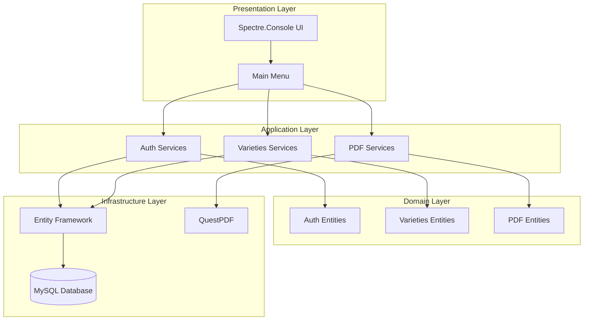

# ☕ Colombian Coffee - Aplicación de Escritorio

[](https://opensource.org/licenses/MIT)

---

## 📖 Descripción del Proyecto

Colombian Coffee es una aplicación de escritorio desarrollada en **C# (.NET 9)** con **Entity Framework Core** y **MySQL**, diseñada para catalogar, filtrar y gestionar las principales variedades de café cultivadas en Colombia.

La aplicación sigue principios **SOLID** y arquitectura **Puertos y Adaptadores (Vertical Slicing)**, con módulos independientes para autenticación, gestión de variedades y exportación a PDF.

---

## 📂 Estructura del Proyecto

```bash
ColombianCoffee/
├── Src/
│   ├── Modules/
│   │   ├── Auth/                    # Gestión de usuarios y autenticación
│   │   │   ├── Application/
│   │   │   │   ├── Interfaces/
│   │   │   │   ├── Services/
│   │   │   │   └── UI/
│   │   │   ├── Domain/
│   │   │   │   └── Entities/
│   │   │   └── Infrastructure/
│   │   │       └── Repositories/
│   │   ├── MainMenu/               # Menú principal de la aplicación
│   │   │   └── UI/
│   │   ├── PDFExport/              # Generación de PDFs de informes
│   │   │   ├── Application/
│   │   │   │   ├── Interfaces/
│   │   │   │   ├── Services/
│   │   │   │   └── UI/
│   │   │   ├── Domain/
│   │   │   │   └── Entities/
│   │   │   └── Infrastructure/
│   │   │       └── Repositories/
│   │   └── Varieties/              # Gestión de variedades de café
│   │       ├── Application/
│   │       │   ├── Interfaces/
│   │       │   ├── Services/
│   │       │   └── UI/
│   │       ├── Domain/
│   │       │   └── Entities/
│   │       └── Infrastructure/
│   │           └── Repositories/
│   └── Shared/
│       ├── Configuration/          # Configuración de entidades
│       ├── Contexts/               # DbContext para EF Core
│       ├── Db/                     # Scripts SQL (DDL y DML)
│       ├── Helpers/                # Clases de ayuda para la app
│       └── Utils/                  # Utilidades generales
├── assets/                         # Recursos estáticos (imágenes, logos)
├── appsettings.json               # Configuración de conexión a base de datos
├── ColombianCoffee.csproj
├── ColombianCoffee.sln            # Solución de Visual Studio
├── Program.cs
└── README.md                      # Documentación del proyecto
```

---

## 🚀 Características Principales

### 🔐 Sistema de Autenticación
- **Gestión de usuarios**: Registro, autenticación y roles (admin/usuario)
- **Seguridad**: Hash de contraseñas con BCrypt.Net
- **Control de acceso**: Diferentes niveles de permisos según el rol

### ☕ Administración de Variedades de Café
- **CRUD completo**: Crear, leer, actualizar y eliminar variedades
- **Datos detallados**: Altitud, especies, linaje, grupos genéticos, unidades de medida
- **Características agronómicas**: Altura de planta, tamaño de grano, potencial de rendimiento
- **Información de cultivo**: Rangos de altitud, densidad de siembra

### 📄 Exportación a PDF Profesional
- **Informes detallados**: Generación con QuestPDF de catálogos profesionales [3](#2-2) 
- **Diseño temático**: Fondos y colores relacionados con café [4](#2-3) 
- **Contenido estructurado**: Tablas organizadas con información agronómica y de cultivo
- **Imágenes integradas**: Fotografías de variedades cuando están disponibles [5](#2-4) 

### 🖥️ Interfaz de Consola Interactiva
- **Menú principal**: Navegación intuitiva con Spectre.Console
- **Menús especializados**: Interfaces dedicadas para cada módulo
- **Experiencia de usuario**: Consola avanzada con elementos visuales atractivos

### 🏗️ Arquitectura Modular
- **Vertical Slice**: Cada módulo es independiente y autocontenido
- **SOLID**: Principios de diseño orientado a objetos
- **Clean Architecture**: Separación clara de responsabilidades
- **Persistencia**: MySQL + Entity Framework Core

---

## 📦 Requisitos Previos

- **.NET 9 SDK** o superior
- **MySQL Server 8.0+**
- **Visual Studio 2022** o superior (opcional)
- **Git** para control de versiones

### Dependencias NuGet Principales
- `Pomelo.EntityFrameworkCore.MySql` - Proveedor MySQL para EF Core
- `QuestPDF` - Generación de documentos PDF
- `Spectre.Console` - Interfaz de consola avanzada
- `BCrypt.Net` - Hash seguro de contraseñas

---

## 🔧 Instalación y Ejecución

### 1. Clonar el Repositorio
```bash
git clone https://github.com/jcristancho2/ColombianCoffee.git
cd ColombianCoffee
```

### 2. Instalar Dependencias
```bash
dotnet restore
```

### 3. Configurar Base de Datos

#### Crear Base de Datos MySQL
```sql
CREATE DATABASE ColombianCoffeeDb CHARACTER SET utf8mb4 COLLATE utf8mb4_unicode_ci;
```

#### Configurar Cadena de Conexión
Edita el archivo `appsettings.json`:
```json
{
  "ConnectionStrings": {
    "DefaultConnection": "Server=localhost;Database=ColombianCoffeeDb;User=root;Password=tu_password;"
  }
}
```

### 4. Aplicar Migraciones
```bash
dotnet ef database update
```

### 5. Ejecutar la Aplicación
```bash
dotnet run
```

---

## 🎯 Guía de Uso

### Para Usuarios Regulares
1. **Iniciar Sesión**: Autenticarse con credenciales de usuario
2. **Explorar Variedades**: Navegar por el catálogo de café colombiano
3. **Consultar Detalles**: Ver información completa de cada variedad
4. **Exportar PDFs**: Generar reportes de variedades específicas

### Para Administradores
1. **Gestión Completa**: Acceso a todas las funcionalidades del sistema
2. **CRUD Variedades**: Crear, editar y eliminar variedades de café
3. **Administrar Usuarios**: Gestionar cuentas y permisos
4. **Reportes Avanzados**: Generar informes completos del sistema

---

## 📄 Sistema de Exportación PDF

### Características de los Reportes
- **Diseño Profesional**: Layout temático con colores café y fondos personalizados
- **Información Completa**: Datos agronómicos, características de cultivo y resistencias
- **Tablas Estructuradas**: Organización clara de la información en formato tabular
- **Metadatos**: Fecha de generación y atribución del documento

### Ubicación de Archivos
- **Directorio de salida**: `~/Documents/ColombianCoffee/Exports/`
- **Nomenclatura**: `Variedad_{ID}_{timestamp}.pdf`
- **Creación automática**: El sistema crea directorios si no existen

---

## 🏗️ Arquitectura del Sistema

### Principios de Diseño
- **Arquitectura Hexagonal**: Separación entre dominio, aplicación e infraestructura
- **Vertical Slicing**: Módulos independientes y autocontenidos
- **SOLID**: Principios de responsabilidad única, abierto/cerrado, etc.
- **Clean Architecture**: Dependencias dirigidas hacia el interior

### Diagrama de Módulos


---

## 📦 Tecnologías Utilizadas

| Tecnología | Versión | Propósito |
|------------|---------|-----------|
| C# | .NET 9 | Lenguaje principal de desarrollo |
| Entity Framework Core | Latest | ORM para acceso a datos |
| MySQL | 8.0+ | Sistema de gestión de base de datos |
| Spectre.Console | Latest | Interfaz de consola avanzada |
| BCrypt.Net | Latest | Hash seguro de contraseñas |
| QuestPDF | Latest | Generación de documentos PDF |
| Git Flow | - | Metodología de control de versiones |
| Conventional Commits | - | Estándar de mensajes de commit |

---

## 🤝 Contribuciones

¡Las contribuciones son bienvenidas! Si deseas mejorar el proyecto, sigue estas directrices:

### Proceso de Contribución
1. **Fork** del repositorio
2. **Crear rama**: `git checkout -b feature/nueva-caracteristica`
3. **Desarrollar** siguiendo los principios establecidos
4. **Commit**: Usar Conventional Commits
5. **Push**: `git push origin feature/nueva-caracteristica`
6. **Pull Request**: Abrir PR con descripción detallada

### Estándares de Código
- Seguir principios SOLID y Clean Architecture
- Mantener la arquitectura hexagonal existente
- Documentar métodos y clases públicas
- Incluir pruebas unitarias cuando sea aplicable
- Usar Conventional Commits para mensajes

---

## 🧑‍💻 Equipo de Desarrollo

- [**Jorge Andrés Cristancho**](https://github.com/jcristancho2) - Líder de Proyecto
- [**Luis Felipe Díaz Correa**](https://github.com/LFDIAZDEV2209) - Desarrollador Fullstack
- [**Sheyla Esther Samur Rojas**](https://github.com/sheyla08samur) - Desarrollo Base de Datos/UX
- [**Leidy Johana Niño Villegas**](https://github.com/LeidyJohanaVillegas) - Desarrollador Fullstack/UX

---

## 🐛 Solución de Problemas

### Errores Comunes

#### Error de Conexión a Base de Datos
- Verificar que MySQL esté ejecutándose
- Comprobar credenciales en `appsettings.json`
- Asegurar que la base de datos `ColombianCoffeeDb` existe

#### Error en Generación de PDF
- Verificar permisos de escritura en directorio de salida
- Comprobar que las imágenes existen en `Src/assets/`
- Validar que QuestPDF esté correctamente instalado

#### Problemas de Dependencias
```bash
dotnet clean
dotnet restore
dotnet build
```

---

## 📝 Licencia

Este proyecto está bajo la licencia [MIT](LICENSE)

---

